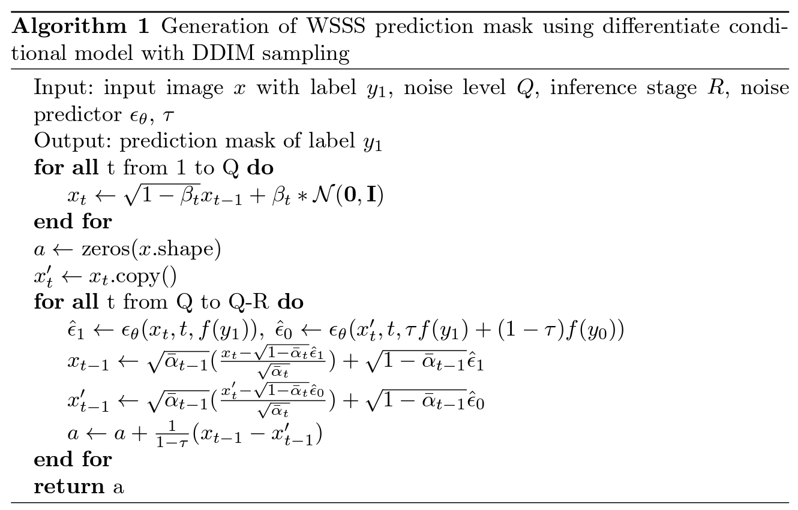

# Conditional Diffusion Models for Weakly Supervised Medical Image Segmentation [MICCAI 2023]
[[`Paper`](https://arxiv.org/pdf/2306.03878.pdf)]

## 0. Setup
### Environment
the required packages are mostly same as [openai/improved_diffusion](https://github.com/openai/improved-diffusion)
Clone this repository and navigate to it in your terminal. Then run:

```
pip install -e .
```
### Dataset
supported 2d datasets: Synapse(128x128), BraTS(224*224) 
The data folder structure is like:

    .
    ├── ...
    ├── data                    
    │   ├── brats_patch            
    │       ├── flair
                ├── flair
                    ├── training
                        ├── normal
                        ├── tumor 
                        ├── seg # label mask
                    ├── validation

## 1. train DDFM models
for tumor images:
```angular2html
MODEL_FLAGS="--num_channels 128 --num_res_blocks 3  "
DIFFUSION_FLAGS="--diffusion_steps 4000 " # --use_kl True
TRAIN_FLAGS="--lr 1e-4 --batch_size 4" #--schedule_sampler loss-second-moment

python scripts/train_tumor_ddfm.py --save_dir runs/results/diff_brats \
--src_dir ${data_dir} --dataset brats \
$MODEL_FLAGS $DIFFUSION_FLAGS $TRAIN_FLAGS
```

conditional training:
```angular2html
MODEL_FLAGS="--image_size 64 --num_channels 192 --num_res_blocks 3 --learn_sigma True --class_cond True"
DIFFUSION_FLAGS="--diffusion_steps 4000 --noise_schedule cosine --rescale_learned_sigmas False --rescale_timesteps False"
TRAIN_FLAGS="--lr 1e-4 --batch_size 4"

python scripts/train_tumor_ddfm.py --save_dir runs/results/diff_brats \
--src_dir ${data_dir} --dataset brats \
$MODEL_FLAGS $DIFFUSION_FLAGS $TRAIN_FLAGS
```
 
## 2. sampling from gaussian noise
The main file is scripts/image_tumor_sample.py, for different dataset, you need:
```angular2html
python scripts/image_tumor_sample.py
```

## 3. guided diffusion
Use an additional classifier model to guide the generation of samples, no need to retrain the DDPM model
### Training models

Training a classifier
```
python scripts/classifier_tumor_train.py --save_dir runs/results/guided_diff_brats_cls_resnet \
--src_dir ${data_dir} --lr 3e-4 --batch_size 8 --model_type resnet50
```

### Sampling:
```angular2html
python scripts/classifier_tumor_sample.py --save_dir runs/results/guided_diff_brats_cls_resnet \
--src_dir ${data_dir}
```

## 4. Weakly supervised segmentation
```angular2html
MODEL_FLAGS="--num_channels 128 --num_res_blocks 3 --learn_sigma True --class_cond True " # --learn_sigma True --class_cond True
DIFFUSION_FLAGS="--diffusion_steps 4000 "
TRAIN_FLAGS="--lr 3e-4 --batch_size 2"

python scripts/image_p_seg.py \
--save_dir {where_you_save_classifier} \
--model_path {where_you_save_diffusion} \
$MODEL_FLAGS $DIFFUSION_FLAGS -f 0 --batch_size 1 --guided
```


